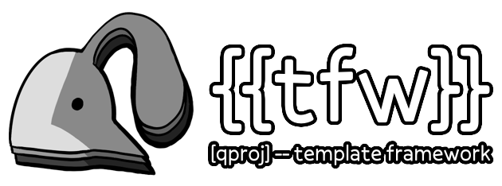

 
<a href="https://github.com/ada-x64/qproj">main project </a>
|
<a href="https://github.com/ada-x64/tfw"> tfw  </a>
 
<a href="https://wraithcastle.com" style="font-size: small">illustration by wraithcastle</a>

This is a simple template for a bevy project.

## System deps

- UNIX-like environment (I use Manjaro Linux)
- [mise](https://mise.jdx.dev)

Call `mise run` to see a list of all the available commands.

### Developing over headless SSH

The mise scripts allow you to develop over SSH. It assumes you have symmetric
SSH access, and that both machines can use rsync. By default, builds will
proceed with -Fdev and -Fdylib, but over ssh we do not dynamically link.
This increases build times but allows us to sync far faster.

## License

This project is available under the terms of either the [Apache 2.0
license](./LICENSE-APACHE.txt) or the [MIT license](./LICENSE-MIT.txt).
